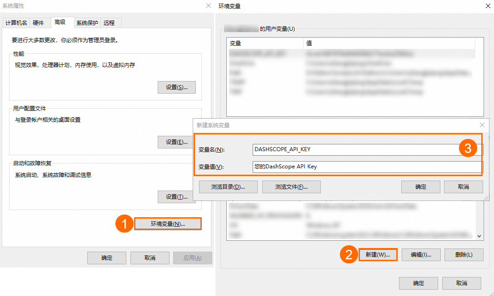
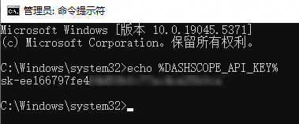
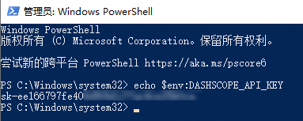

#  配置apikey到环境变量

## 前提条件

已开通百炼并获取API Key，具体请参见[获取API Key](https://help.aliyun.com/zh/model-studio/get-api-key)。

## 操作步骤

Linux系统

macOS系统

Windows系统

在Windows系统中，您可以通过系统属性、CMD或PowerShell配置环境变量。

系统属性

CMD

PowerShell

**说明**

- 此方式配置的环境变量永久生效。
- 修改系统环境变量需具备管理员权限。
- 配置环境变量后不会立即影响已经打开的命令窗口、IDE或其他正在运行的应用程序。您需要重新启动这些程序或者打开新的命令行使环境变量生效。

1. 在Windows系统桌面中按`Win+Q`键，在搜索框中搜索**编辑系统环境变量**，单击打开**系统属性**界面。

2. 在**系统属性**窗口，单击**环境变量**，然后在**系统变量**区域下单击**新建**，**变量名**填入`DASHSCOPE_API_KEY`，**变量值**填入您的DashScope API Key。

   

3. 依次单击三个窗口的**确定**，关闭系统属性配置页面，完成环境变量配置。

4. 打开CMD（命令提示符）窗口或Windows PowerShell窗口，执行如下命令检查环境变量是否生效。

   - CMD查询命令：

      

     ```powershell
     echo %DASHSCOPE_API_KEY%
     ```

     

   - Windows PowerShell查询命令：

      

     ```powershell
     echo $env:DASHSCOPE_API_KEY
     ```

     

## 常见问题

Q：用echo命令确认环境变量设置成功了，为什么运行代码还是提示找不到API Key？

A：具体原因如下：

- 情况一：**没有设置永久性环境变量**。临时环境变量只在当前终端会话有效，对于已经启动的 IDE 或其他应用程序并不会生效。请参考本文中设置永久性环境变量的方法。
- 情况二：**没有重启IDE、命令行工具或应用**。
  - 通常需要重启IDE（如VS Code）或命令行工具，使其能够加载最新的环境变量。
  - 如果在部署应用后设置了环境变量，可能需要重启应用服务，让应用能够重新加载环境变量。
- 情况三：**需要在配置文件添加环境变量**。如果您的应用是通过服务管理器（如systemd、supervisord）启动的，可能需要在服务管理器的配置文件中添加环境变量。
- 情况四：**用了sudo命令**。如果使用`sudo python xx.py`运行脚本，可能会遗漏当前用户环境变量，因为`sudo`默认不继承所有环境变量。您可采用`sudo -E python xx.py`命令，其中的`-E` 参数确保环境变量被传递。如有权限执行该脚本，可以直接执行 `python xx.py`。